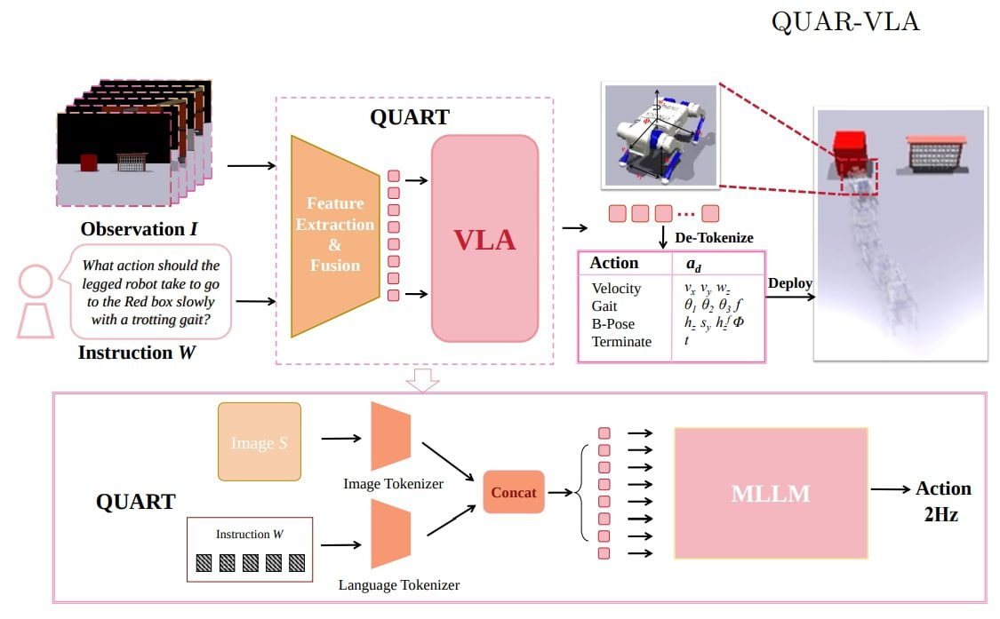

# VLA

A Vision-Language-Action (VLA) model is a type of AI model that enables robots to understand and respond to natural language instructions by combining vision and language understanding with robot control. Essentially, VLAs allow robots to perform tasks by interpreting both what they see and what they are told, bridging the gap between human instructions and robotic actions. 
Key aspects of VLA models:

    Vision and Language Understanding:
    VLAs integrate vision and language models, allowing them to process visual information from cameras and understand textual instructions. 

Action Control:
They translate the combined understanding of vision and language into actionable commands for the robot, enabling it to perform tasks. 
Generalization and Transfer Learning:
VLAs can be pre-trained on large datasets of visual-language pairs and then fine-tuned for specific robotic tasks, allowing them to generalize to new situations and environments. 
Natural Language Control:
A major advantage is the ability to control robots using natural language, making them more user-friendly and accessible. 
Examples:
RT-2 from Google DeepMind and OpenVLA are examples of VLAs that demonstrate the capabilities of these models. 

How they work:

    Input: The VLA receives visual input (images, videos) and a textual instruction.
    Interpretation: The model processes both inputs, understanding the scene and the user's intent.
    Action Generation: Based on this understanding, the VLA generates a sequence of robot actions to achieve the desired outcome. 

Applications:

    Robotic Manipulation:
    VLAs can be used to control robotic arms for tasks like picking and placing objects, opening drawers, and using tools. 

Autonomous Navigation:
They can help robots navigate complex environments, both indoors and outdoors, by interpreting visual cues and following verbal commands. 
Human-Robot Collaboration:
VLAs can facilitate collaboration between humans and robots, enabling humans to guide robots using natural language. 

In essence, VLA models represent a significant step towards more intelligent and versatile robots, capable of understanding and interacting with the world in a more human-like way. 

## refs:

* https://en.wikipedia.org/wiki/Vision-language-action_model
* https://openvla.github.io/
* 