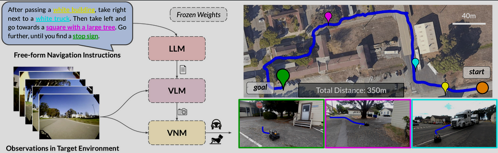
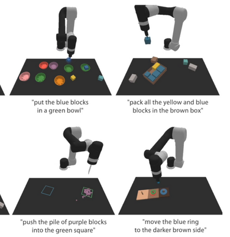

# demo land

## LM‑Nav

uses a pre‑trained visual navigation model (ViNG) for topological mapping, CLIP for grounding landmarks, and GPT‑3 for extracting landmarks from natural language.

* https://ar5iv.labs.arxiv.org/html/2207.04429#:~:text=plan%20using%20three%20pre,tuning

## CLIPort

 A “what” stream identifies objects and a “where” stream provides pick‑and‑place positions.

https://cliport.github.io/#:~:text=that%20combines%20the%20best%20of,where%29%20of%20TransporterNets

